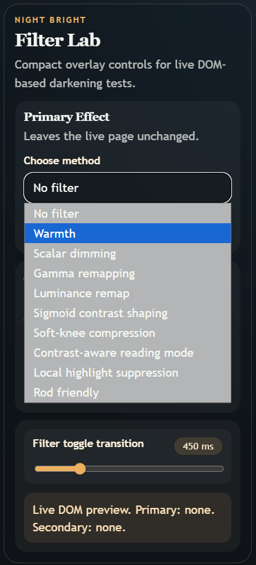

# Night Bright Test Bench

This project is a testbench for night-time browser filters

CSS filters, overlay layers, and targeted DOM restyling are applied via a small control UI:



The main folder is a DOM-based playground for testing screen-darkening ideas against two simple stressors:

- four bright placeholder images
- one white reading block with black text

## What The Page Contains

- A compact transparent control overlay with:
  - a primary effect dropdown
  - a secondary effect dropdown
  - per-effect parameter sliders
  - a transition-time slider
- A live content surface with:
  - 4 inline SVG placeholder images
  - a white article card with black text

## Implementation Model

The page uses two nested wrappers so the primary effect runs first and the secondary effect layers on top of it:

```html
<div id="secondary-wrapper" class="effect-wrapper">
  <div id="secondary-overlay" class="effect-layer"></div>

  <div id="primary-wrapper" class="effect-wrapper">
    <div id="primary-overlay" class="effect-layer"></div>
    <main id="content-root" class="content-root">
      ...
    </main>
  </div>
</div>
```

Each effect resolves to three pieces of output:

- `filter`: CSS filter functions applied to the wrapper
- `overlay`: a full-surface tint or blend layer
- `content`: targeted adjustments for the white reading block and the image gallery

That shape is the core idea behind the whole system:

```js
function buildSlotResult(methodKey, values) {
  return {
    filter: "brightness(...) contrast(...)",
    overlay: {
      opacity: 0.2,
      background: "linear-gradient(...)",
      mixBlendMode: "multiply",
      backdropFilter: "none"
    },
    content: {
      readingAmount: 0.4,
      localSuppression: 0.2,
      rodAmount: 0
    }
  };
}
```
---

## Effect Reference

### 1. Warmth

Purpose:
Reduce blue-heavy harshness and push the page toward a calmer amber balance.

Controls:
- `effect strength`
- `greenScale`
- `blueScale`

Current implementation:
- lowers saturation and brightness slightly
- adds a warm multiply overlay
- reacts more strongly as blue and green are reduced

Most useful when:
- the page feels too cold or sharp
- bright white surfaces are acceptable, but blue accents feel loud

Key implementation excerpt:

```js
case "warmth": {
  const greenLoss = 1 - values.greenScale;
  const blueLoss = 1 - values.blueScale;

  return {
    filter: composeFilter([
      `saturate(${cssNumber(1 - amount * (blueLoss * 0.18 + greenLoss * 0.06))})`,
      `brightness(${cssNumber(1 - amount * (blueLoss * 0.07 + greenLoss * 0.03))})`
    ]),
    overlay: {
      opacity: clamp01(amount * (0.14 + blueLoss * 0.42 + greenLoss * 0.18)),
      background: "linear-gradient(180deg, rgba(255, 184, 112, 0.72), rgba(255, 116, 78, 0.48))",
      mixBlendMode: "multiply",
      backdropFilter: "none"
    },
    content: defaultContentAdjust()
  };
}
```

---

### 2. Scalar Dimming

Purpose:
Perform the bluntest possible darkening pass: scale the whole page down.

Controls:
- `effect strength`
- `dimScale`
- `shadowFloor`

Current implementation:
- reduces wrapper brightness directly
- slightly softens contrast as shadow floor increases
- adds a faint dark multiply veil

Most useful when:
- you want a baseline to compare smarter methods against
- you need a fast, predictable global dim

---

### 3. Gamma Remapping

Purpose:
Darken midtones and highlights more than shadows.

Controls:
- `effect strength`
- `exponent`
- `shadowLift`

Current implementation:
- interprets exponent as a stronger darkening depth
- keeps some low-end visibility through `shadowLift`
- adds mild contrast and a subtle dark multiply layer

Most useful when:
- scalar dimming feels too flat
- mids still feel too bright after plain brightness reduction

---

### 4. Luminance Remap

Purpose:
Reduce brightness with less disruption to perceived color relationships.

Controls:
- `effect strength`
- `lumaGamma`
- `lumaFloor`

Current implementation:
- dims brightness with a luminance-shaped curve
- desaturates slightly less than gamma remap
- uses a dark overlay that is gentler than plain scalar dimming

Most useful when:
- colors still need to read as colors
- you want something more tone-aware than a simple multiplier

---

### 5. Sigmoid Contrast Shaping

Purpose:
Darken the page while reshaping contrast around a chosen midpoint.

Controls:
- `effect strength`
- `midpoint`
- `steepness`

Current implementation:
- changes both brightness and contrast
- lets `midpoint` shift where the contrast bend feels centered
- lets `steepness` strengthen the shoulder/toe effect

Most useful when:
- you want more structure than gamma alone
- you need to hold separation in some parts of the page while calming others

---

### 6. Soft-Knee Compression

Purpose:
Compress highlights without a hard, abrupt cutoff.

Controls:
- `effect strength`
- `threshold`
- `knee`

Current implementation:
- dims based on remaining headroom above the threshold
- slightly lowers contrast as the knee softens
- uses a warm-to-dark multiply overlay and a tiny backdrop brightness adjustment

Most useful when:
- the page has a few hotspots that dominate attention
- you want highlights rolled off rather than simply darkened everywhere

---

### 7. Contrast-Aware Reading Mode

Purpose:
Turn mostly white reading surfaces into restrained dark panels while lifting text into a capped contrast range.

Controls:
- `effect strength`
- `whiteThreshold`
- `contrastCap`
- `darkSurface`

Current implementation:
- dark-themes the white reading block
- remaps text away from pure black toward a bounded gray
- slightly desaturates the overall page while applying the reading transform

Most useful when:
- the white article block is the main problem
- you want something closer to a manual dark theme than a pure optical filter

Key implementation excerpt:

```js
case "readingMode": {
  const content = defaultContentAdjust();
  content.readingAmount = amount * lerp(0.65, 1, clamp01((1 - values.whiteThreshold) / 0.35));
  content.whiteThreshold = values.whiteThreshold;
  content.contrastCap = values.contrastCap;
  content.darkSurface = values.darkSurface;

  return {
    filter: composeFilter([
      `brightness(${cssNumber(1 - amount * 0.05)})`,
      `saturate(${cssNumber(1 - amount * 0.1)})`
    ]),
    overlay: {
      opacity: clamp01(amount * 0.08),
      background: "rgba(8, 10, 12, 0.92)",
      mixBlendMode: "multiply",
      backdropFilter: "none"
    },
    content
  };
}
```

---

### 8. Local Highlight Suppression

Purpose:
Suppress image hotspots and reduce the glare halo from bright surfaces.

Controls:
- `effect strength`
- `radius`
- `sensitivity`
- `cap`

Current implementation:
- darkens the whole page slightly
- adds radial multiply gradients to the effect layer
- pushes extra image-specific dimming and white-block highlight reduction through `content`

Most useful when:
- the brightest regions, not the whole page, are causing strain
- image hotspots are more annoying than body text

---

### 9. Rod Friendly

Purpose:
Reduce saturation and blue while narrowing the page into a calmer luminance band.

Controls:
- `effect strength`
- `desaturation`
- `blueScale`
- `ceiling`

Current implementation:
- lowers saturation
- reduces brightness based on the chosen luminance ceiling
- adds a warm multiply overlay
- contributes extra image desaturation and highlight calming through the combined content stage

Most useful when:
- color intensity is the problem
- you want a more subdued, adaptation-friendly page instead of a sharp dark theme

---

## ex blocks

### 1. Placeholder Images Are Self-Contained

The page uses inline SVG data URIs, so there are no external image dependencies:

```js
function buildPlaceholderSvg(entry) {
  const [top, mid, base] = entry.colors;
  const svg = `
    <svg xmlns="http://www.w3.org/2000/svg" viewBox="0 0 1600 1000">
      <defs>
        <linearGradient id="bg" x1="0" y1="0" x2="1" y2="1">
          <stop offset="0%" stop-color="${top}"/>
          <stop offset="54%" stop-color="${mid}"/>
          <stop offset="100%" stop-color="${base}"/>
        </linearGradient>
      </defs>
      <rect width="1600" height="1000" fill="url(#bg)"/>
      ...
    </svg>
  `;

  return `data:image/svg+xml;charset=UTF-8,${encodeURIComponent(svg)}`;
}
```

### 2. Content Adjustments Are Combined Separately From Wrapper Filters

This is what lets the page treat the white reading block and the gallery differently from the rest of the page:

```js
function combineContentAdjustments(results) {
  const combined = defaultContentAdjust();

  for (const result of results) {
    combined.readingAmount = clamp01(combined.readingAmount + result.content.readingAmount);
    combined.darkSurface = Math.min(combined.darkSurface, result.content.darkSurface);
    combined.localSuppression = clamp01(combined.localSuppression + result.content.localSuppression);
    combined.rodAmount = clamp01(combined.rodAmount + result.content.rodAmount);
  }

  return combined;
}
```

### 3. White-Block And Gallery Tuning Happens In One Place

This function is where the page turns combined effect state into actual CSS variables:

```js
function applyContentAdjustments(combined) {
  const readingGray = lerp(1, combined.darkSurface, combined.readingAmount);
  const cappedText = clamp01(combined.darkSurface + combined.contrastCap);

  dom.contentRoot.style.setProperty("--reading-bg", grayColor(readingGray));
  dom.contentRoot.style.setProperty("--reading-text", grayColor(lerp(0, cappedText, combined.readingAmount)));

  const localFactor = clamp01(
    combined.localSuppression * lerp(0.65, 1.15, clamp01((0.3 - combined.localSensitivity) / 0.28))
  );

  dom.contentRoot.style.setProperty(
    "--gallery-image-filter",
    composeFilter([
      `brightness(${cssNumber(imageBrightness)})`,
      `contrast(${cssNumber(imageContrast)})`,
      `saturate(${cssNumber(imageSaturation)})`
    ])
  );
}
```

### 4. Applying Effects Is Just A Small Pipeline

This is the full runtime loop: resolve each slot, paint its visuals, merge content behavior, update the status text.

```js
function applyAllEffects() {
  const results = SLOT_KEYS.map((slotKey) => {
    const slot = appState.slots[slotKey];
    const result = buildSlotResult(slot.method, slot.method === "none" ? {} : slot.values[slot.method]);
    applySlotVisuals(slotKey, result);
    return result;
  });

  applyContentAdjustments(combineContentAdjustments(results));
  updateStatus();
}
```

## Practical Notes

- The current effects are **DOM-friendly approximations**, not pixel-accurate implementations of the original formulas.
- `readingMode` specifically targets the single white reading block on this page.
- `highlightSuppression` is simulated with overlay gradients and image-specific filter changes, not a true local luminance analysis.
- The secondary effect is layered by wrapper nesting, so it conceptually sits on top of the primary effect.

## Files

- `index.html`: page structure and content surface
- `styles.css`: overlay UI, effect layers, reading block, and gallery styling
- `script.js`: control generation, placeholder image generation, effect modeling, and live updates

## Chrome Extension Packaging

A ready-to-load extension now lives in `chrome-extension/`.

- `chrome-extension/manifest.json`: Manifest V3 definition for applying effects to existing tabs
- `chrome-extension/popup.html`, `chrome-extension/popup.css`, `chrome-extension/popup.js`: extension popup controls
- `chrome-extension/effect-model.js`: shared extension-side effect definitions and parameter defaults
- `chrome-extension/content.css`, `chrome-extension/content.js`: page injection logic
- `chrome-extension/README.md`: unpacked-loading instructions

The root `index.html` testbench remains independent so parameters can still be tuned outside the extension.

*** Delete File: chrome-extension/background.js
*** Delete File: chrome-extension/build.ps1
*** Delete File: chrome-extension/index.html
*** Delete File: chrome-extension/styles.css
*** Delete File: chrome-extension/script.js
